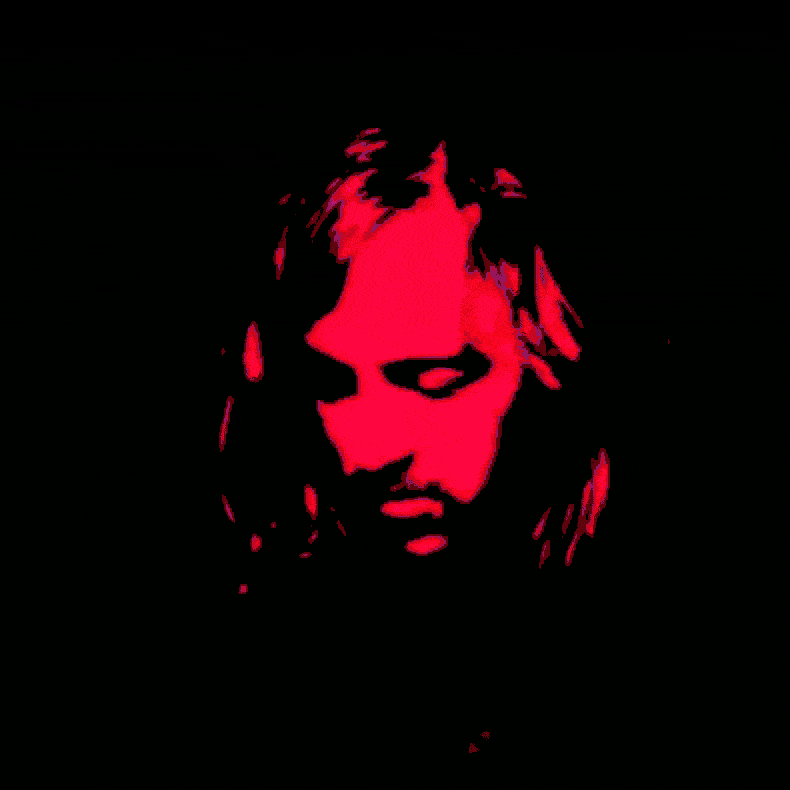

<h1 align=center>

</h1>

# Whoami? ZQWY! 

## Творческий гибрид: слепленный разными цветами, залит палитрой и стихами, музыкальный визионерский колорит.

<h1 align=center>

</h1>

##

## В путь к пустоте, во тьме - сложность мыслей. А суть к полноте, в свете - легкость идей. 

## Формирование методов, симметрии:  Еврейская естественность и Греческая мыслительность. Различия отличительные, зеркальные, но разительные.

# 2