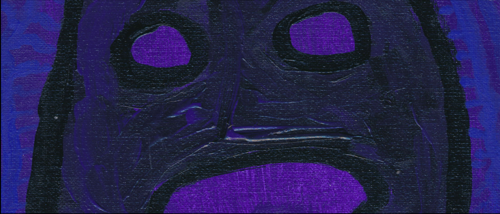

<h1 align=center>

</h1>

![[clear-lq.gif]]

## Творческий гибрид: слепленный разными цветами, залит палитрой и стихами, музыкальный визионерский колорит.

## В путь к пустоте, во тьме - сложность мыслей. А суть к полноте, в свете - легкость идей.

## Формирование методов, симметрии: Еврейская естественность и Греческая мыслительность. Различия отличительные, зеркальные, но разительные.