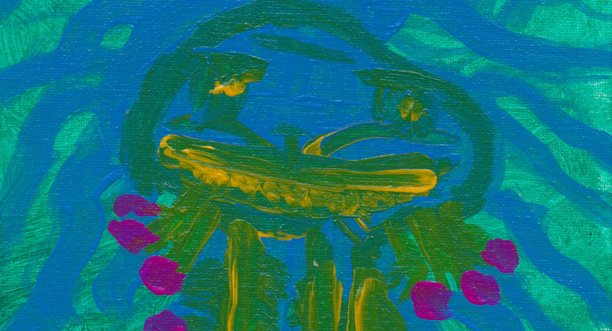

<h1 align=center>

</h1>

<iframe src="https://audiomack.com//embed/zqwy/album/axolotl" scrolling="no" width="100%" height="400" frameborder="0" title="Axolotl"></iframe>

## BASS MITZVA

### Пустыня. Песок. Только тишина, и больше ничего. Аксолотль лежит на спине, в небольшой луже воды. Вокруг сухой песок янтарного цвета, словно застывший свет древнего заката. В этот момент ему было уютно, хоть и выглядел так, будто бы умер. Небольшой клочок прохлады на его спине контрастировал с настойчивой теплотой солнечных лучей. Его перистые жабры вяло покачивались, были почти неподвижны. Аксолотль лежал с закрытыми глазами; у него были небольшие тёмные глаза с синеватой обводкой. Закрытый взгляд устремлён прямо в светлое бездонное небо. Для него этот мир сузился до этой капли жизни, окружённой тревогой. Аксолотль, этот удивительный обломок вечности, продолжал лежать на спине, маленький островок розовой жизни посреди янтарной пустыни, глядя в бесконечность. Вокруг пустыня, и данный момент – спокойный момент – идеальный момент – тишина. Единственный звук, нарушитель тишины, – нежный шелест ветра, перекатывающего крупинки песка, создавая крошечные, мимолётные барханы вокруг его временного убежища. 
