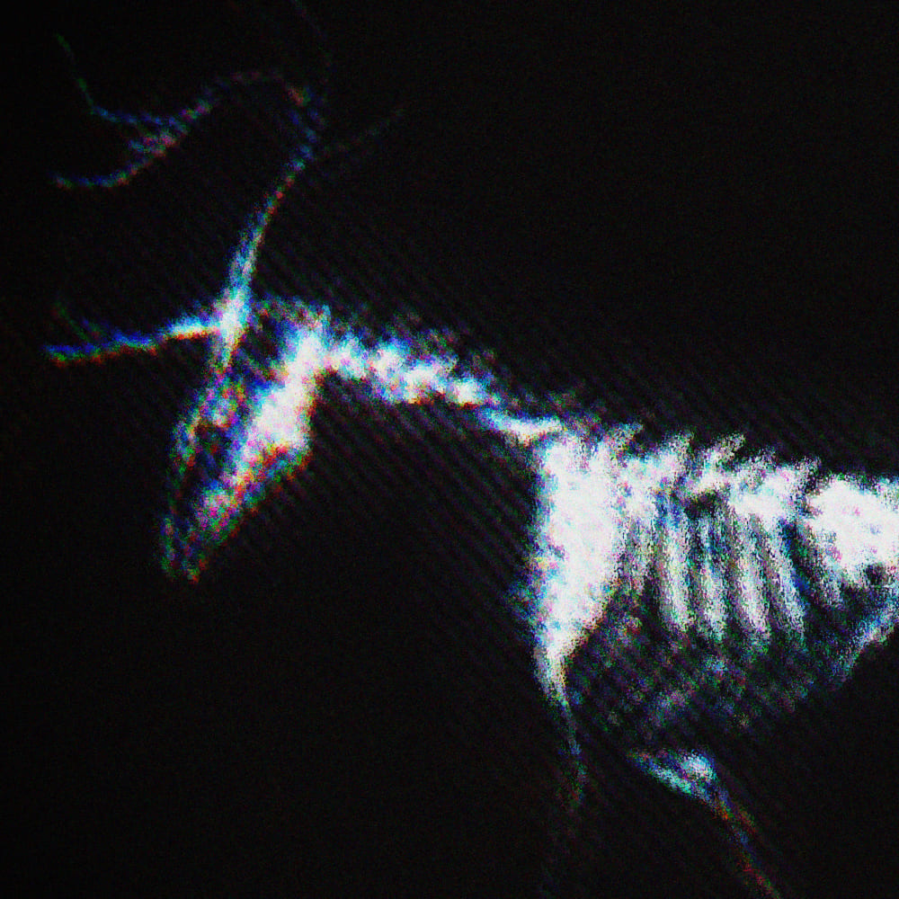

<h1 align=center>

</h1>

<iframe src="https://audiomack.com//embed/zqwy/song/biela" scrolling="no" width="100%" height="300" frameborder="0" title="Biela"></iframe>

# Загадочный саундтрек: мистический, эзотерический оркестр

>[!info] Описание Композиции
> # Эпический скандинавский фольклёр. Мрачный эпос, таинственное фэнтези, эфирный фолк. Фолкотроника эмбиент и страшный фонк. Сумеречный скрытный и запретный оккультизм. Слияние восточного и западного, мифологический синкопированный хтонический нигилизм. Магическая энергия, арканическая ритуальность и спиритуальность.

>[!abstract] Сюжет Композиции
># Белая лань с помощью [[algiz|руны]] осталась [[The_Remaining|одной из выживших]]. В отличие от тёмной лани, которая была связана с помощью [[Odal|другой руны]] и находилась по другую сторону [[music/long_play/Na_Hrane/Attachments/Lores/Na_Hrane|междумирья]]. Её суть - уничтожить всё на собственном пути!

>[!faq] Какие Инструменты Используются в Композиции?
># Флейта, тальхарпа, пианино, ковбел, акустические и синтезированные ударные, а также перкуссии, синтезатор

>[!faq] Музыкальные Характеристики
># аккорд: natural (Emin); ритм: повторяющийся бит; мелодия: contemplative, dark, dreamy; динамика: epic, discovery; тембр: спокойный; жанры: фонк (phonk), фолк (folk), эмбиент (ambient)
>тэги: chaotic, ethereal, haunting, magical, mystical, nature, reflective, repetitive, searching, mysterious,, ambient, esoteric, occultism, magic, scandinavian, nihilism, chthonic, arcane, secretive, spirituality, mythological, fantasy, 19th century, ritual, twilight, forbidden

>[!faq] Саундтрек для
># Трейлера, фильма, видеоигры, видео, рекламы, тиктока или шорта

>[!faq] Где Можно Послушать? 🤔 А Вот и Списочек! 🫡
>🤔 [pond5](https://www.pond5.com/ru/royalty-free-music/item/323659995-mysterious-soundtrack-esoteric-atmosphere-orchestra-folk-pho)  🟢 [spotify](https://open.spotify.com/album/61O9fZ5G4yQeP6zbstNIGk)  🟪 [sumbit_hub](https://www.submithub.com/link/zqwy-biela)   🎶 [sound_cloud](https://soundcloud.com/zqwy-sc/biela)   🔊 [sound_click](https://soundclick.com/song/15175991)   🎼 [Audiomack](https://audiomack.com/zqwy/song/biela)  🎤 [rap_chat](https://rapchat.com/beats/A3087890-EA50-11F0-AD02-0944064249B0)   🍏 [apple_music](https://music.apple.com/ru/album/biela-single/1781826881)  📦 [amazon_music](https://music.amazon.com/albums/B0DLNFSV9N)  👍 [yandex_music](https://music.yandex.ru/album/33870363)  🥚 [mts_music](https://music.mts.ru/album/33870363)  🏛️ [sber_zvuk](https://zvuk.com/release/35985388)   🌀 [shazam](https://www.shazam.com/album/1781826881/biela-single)   🎵 [band_camp](https://zqwy.bandcamp.com/track/biela) 👌 [ok](https://ok.ru/music/album/122964261241800)   🛜 [vk](https://vk.com/audio-2001995875_131995875)  🎆 [boomplay](https://www.boomplay.com/songs/187661112)
>discogs
>allmusic
>[lastfm](https://www.last.fm/music/Zqwy/Biela)
>

>[!faq] Другие языки
>English
>Mysterious soundtrack. A mystical, esoteric orchestra and epic Scandinavian folklore. Dark epic, mysterious fantasy, ethereal folk. Folktronica ambient and eerie funk. Twilight, secretive, and forbidden occultism. A fusion of Eastern and Western, mythological syncopated chthonic nihilism. Magical energy, arcane ritual, and spirituality. 
