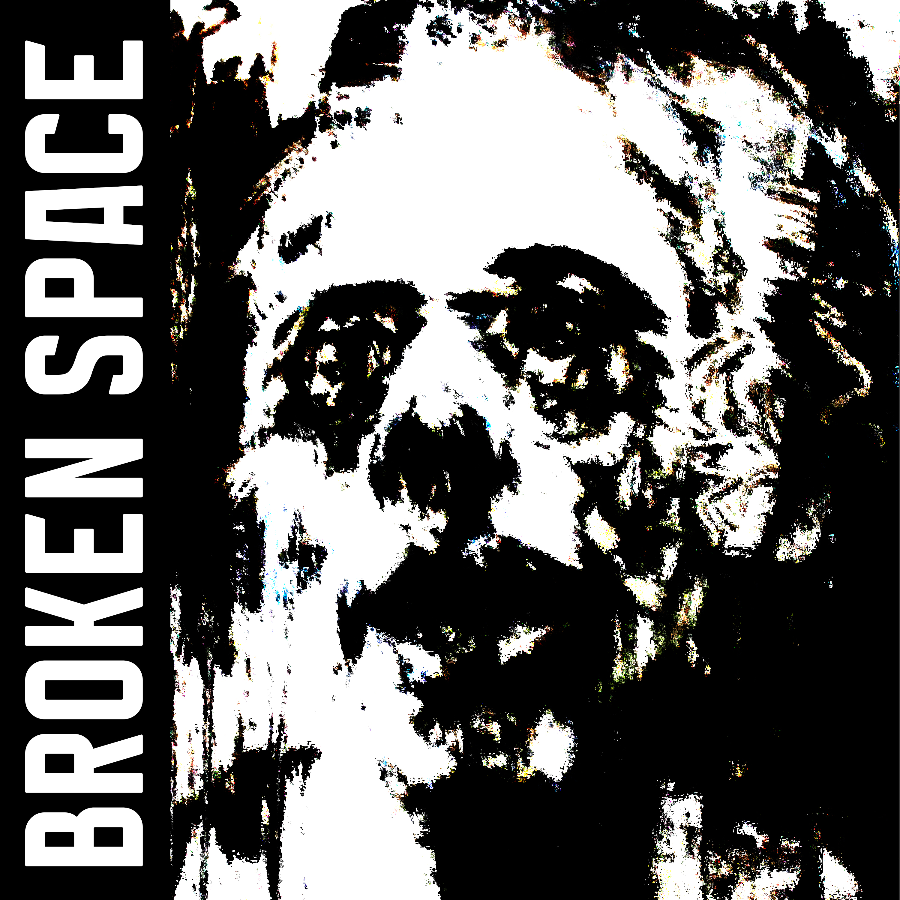

<h1 align=center>

</h1>

<iframe src="https://audiomack.com//embed/zqwy/song/broken-space" scrolling="no" width="100%" height="252" frameborder="0" title="Broken Space"></iframe>

# Подавляющая, гнетущая атмосфера безнадёжности и бессмысленности. Попытки человеческого разума, как пытки и поиски действительности, в реальности способной решительности в новом колонизаторстве.

# Связующая роль с [[dystopian_future|утопичным будущем]]
