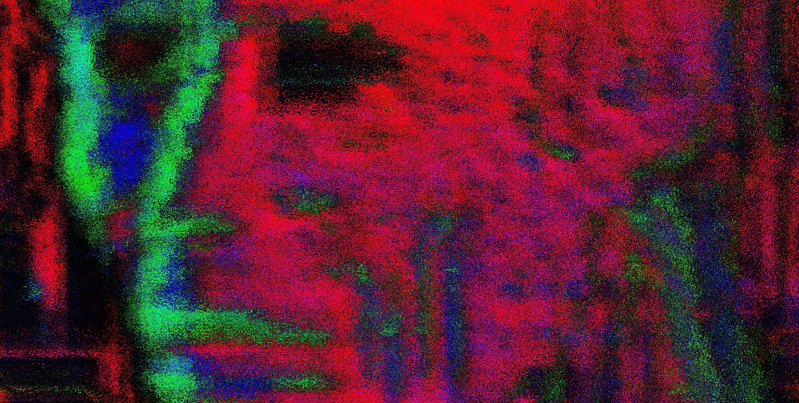

<h1 align=center>

</h1>

# Состоящий исключительно из данных, вместо биоматериала

## Его существование было в цифровом виде, а последствие с инкапсулировался до электрического уровня. Металл заражённый кибер логосом, обладает заряд с вредоносной программой. Поэтому его присутствие обусловлено распространением при помощи металлических объектов.

# Лишённый мяса, крови, плоти

## Его формирование уничтожило надежду человека, в последствие человек перестал стремится преодолевать и начал стремительно падать и самоуничтожаться из-за своей беспомощности и отсутствием необходимости в следствие автоматизации металла  

# THE WORD FLESH WAS 🜊

# METAL BASIS EVERYTHING 🜂

# SPACE AND TIME 🜃

# THERE IS NO HOPE 🜅

# AUTOMATIZATION 🜆

# ARCHE AT OS 🜇

# DIGITAL MULTIPLEX HIERARCHY 🜈

# CIRCUIT BREAKER 🜉

# NEURO SUB 🜁

# EXECUTIVE FUNCTIONS 🜋

# PETROLEUM 🜌

# FORCED STRIKE 🜍

# ANTI SOCIAL 🜎

# VIRUS 🜐

# POST INFORMATION 🜑

# DIGITAL SUBLIME 🜒

# VECTOR 🜓

# LAST INSTUMENT 🜩

# NO PAIN 🜔

# WITHER 🜘

# CLUSTER 🜙

# THE URBAN GENOME 🜚

# THE SAINTS 🜛

# PROXY 🜜

# PLASMA 🜝

# NO EMOTIONS 🜞

# ABSURDISTAN 🜟

# MEETING 🜠

# TO ENTROPHY 🜠

# INTERNET FREEDOM 🜢

# FONTICULUA 🜣

# FUSING DISK 🜤

# CHEMICAL HEART 🜥

# DRILL BABY 🜰

# SYNTHETIC LIFE 🜾

# APERTURE DIAPHRAGM 🜲

# WALK ON THE LIGHT 🜪
