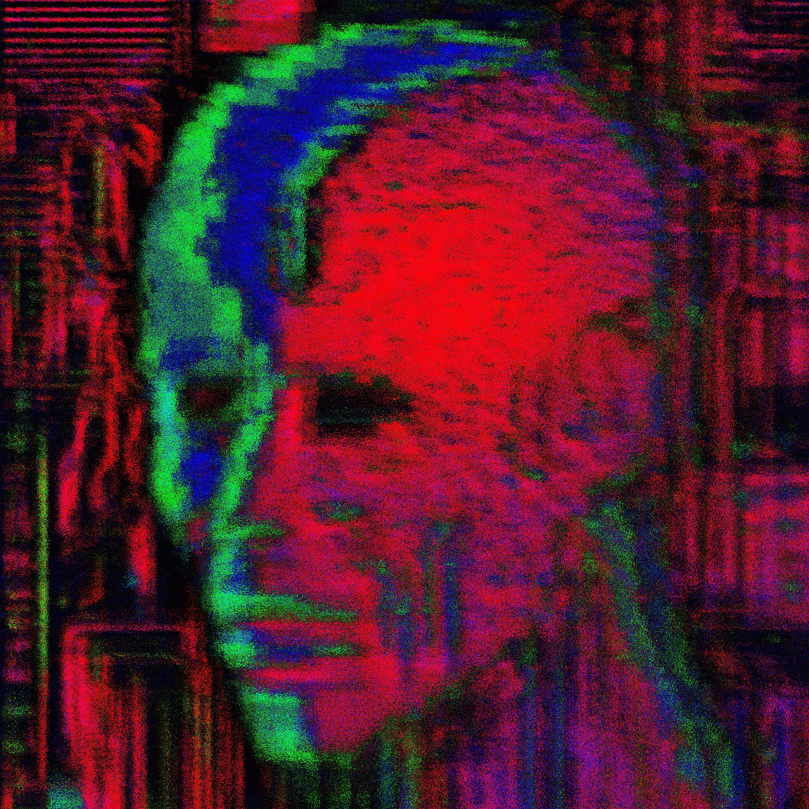

<h1 align=center>

</h1>

<iframe src="https://audiomack.com//embed/zqwy/album/cyber-logos" scrolling="no" width="100%" height="800" frameborder="0" title="cyber_logos"></iframe>

# Кибер Логос состоит исключительно из данных, а не из органического или синтетического материала 

## Его существование было в цифровом виде, а последствие с инкапсулировался до электрического уровня. Метал заражённый кибер логосом, обладает заряд с вредоносной программой. Поэтому его присутствие обусловлено распространением при помощи металлических объектов.

# Лишённый мяса, крови, плоти

## Его формирование уничтожило надежду человека, в последствие человек перестал стремится преодолевать и начал стремительно падать и самоуничтожаться из-за своей беспомощности и отсутствием необходимости в следствие автоматизации металла  

# [the_word_flesh_was](https://www.pond5.com/ru/royalty-free-music/item/293487558-electronic-cyber-dance-word-flesh-was) 🜊

# [metal_basis_everything](https://www.pond5.com/ru/royalty-free-music/item/293487557-electronic-cyber-dance-metal-basis-everything) 🜂

# [space_and_time](https://www.pond5.com/ru/royalty-free-music/item/293487631-electronic-cyber-dance-space-and-time) 🜃

# [there_is_no_hope](https://www.pond5.com/ru/royalty-free-music/item/293487615-electronic-cyber-dance-there-no-hope) 🜅

# [automatization](https://www.pond5.com/ru/royalty-free-music/item/293487709-electronic-cyber-dance-automatization) 🜆

# [arche_at_os](https://www.pond5.com/ru/royalty-free-music/item/293487677-electronic-cyber-dance-arche-os) 🜇

# [digital_multiplex_hierarchy](https://www.pond5.com/ru/royalty-free-music/item/293487680-electronic-cyber-dance-digital-multiplex-hierarchy) 🜈

# [circuit_breaker](https://www.pond5.com/ru/royalty-free-music/item/293487692-electronic-cyber-dance-circuit-breaker) 🜉

# [neuro_sub](https://www.pond5.com/ru/royalty-free-music/item/293485649-electronic-cyber-dance-neuro-sub) 🜁

# [executive_functions](https://www.pond5.com/ru/royalty-free-music/item/293485647-electronic-cyber-dance-executive-functions) 🜋

# [petroleum](https://www.pond5.com/ru/royalty-free-music/item/293485601-electronic-cyber-dance-petroleum) 🜌

# [forced_strike](https://www.pond5.com/ru/royalty-free-music/item/293485645-electronic-cyber-dance-forced-strike) 🜍

# anti_social 🜎

# [null](https://www.pond5.com/ru/royalty-free-music/item/293485660-electronic-cyber-dance-null)
# [virus](https://www.pond5.com/ru/royalty-free-music/item/293485706-electronic-cyber-dance-virus) 🜐

# [post_information](https://www.pond5.com/ru/royalty-free-music/item/293485818-electronic-cyber-dance-post-information) 🜑

# [digital_sublime](https://www.pond5.com/ru/royalty-free-music/item/293486284-electronic-cyber-dance-digital-sublime) 🜒

# vector 🜓

# [last_instument](https://www.pond5.com/ru/royalty-free-music/item/293486468-electronic-cyber-dance-last-instument) 🜩

# [no_pain](https://www.pond5.com/ru/royalty-free-music/item/293486466-electronic-cyber-dance-no-pain) 🜔

# [wither](https://www.pond5.com/ru/royalty-free-music/item/293486542-electronic-cyber-dance-wither) 🜘

# [cluster](https://www.pond5.com/ru/royalty-free-music/item/293486711-electronic-cyber-dance-cluster) 🜙

# [the_urban_genome](https://www.pond5.com/ru/royalty-free-music/item/293486852-electronic-cyber-dance-urban-genome) 🜚

# [the_saints](https://www.pond5.com/ru/royalty-free-music/item/293486781-electronic-cyber-dance-saints) 🜛

# [proxy](https://www.pond5.com/ru/royalty-free-music/item/293530072-electronic-cyber-dance-proxy) 🜜

# [plasma](https://www.pond5.com/ru/royalty-free-music/item/293486933-electronic-cyber-dance-plasma) 🜝

# [no_emotions](https://www.pond5.com/ru/royalty-free-music/item/293486998-electronic-cyber-dance-no-emotions) 🜞

# [absurdistan](https://www.pond5.com/ru/royalty-free-music/item/293487276-28-absurdistan) 🜟

# [meeting](https://www.pond5.com/ru/royalty-free-music/item/293487101-electronic-cyber-dance-meeting) 🜠

# [to_entrophy](https://www.pond5.com/ru/royalty-free-music/item/293487201-electronic-cyber-dance-entrophy) 🜠

# [internet_freedom](https://www.pond5.com/ru/royalty-free-music/item/293487316-electronic-cyber-dance-internet-freedom) 🜢

# [fonticulua](https://www.pond5.com/ru/royalty-free-music/item/293487275-electronic-cyber-dance-fonticulua) 🜣

# [fusing_disk](https://www.pond5.com/ru/royalty-free-music/item/293487277-electronic-cyber-dance-fusing-disk) 🜤

# [chemical_heart](https://www.pond5.com/ru/royalty-free-music/item/293487315-electronic-cyber-dance-chemical-heart) 🜥

# [drill_baby](https://www.pond5.com/ru/royalty-free-music/item/293487556-electronic-cyber-dance-drill-baby) 🜰

# [synthetic_life](https://www.pond5.com/ru/royalty-free-music/item/293487325-electronic-cyber-dance-synthetic-life) 🜾

# [aperture_diaphragm](https://www.pond5.com/ru/royalty-free-music/item/293487337-electronic-cyber-dance-aperture-diaphragm) 🜲

# [walk_on_the_light](https://www.pond5.com/ru/royalty-free-music/item/293487474-electronic-cyber-dance-walk-light) 🜪

# first_patch

## find_by_traces

## blending_textures

## close_shift

## organisation

## kernel_panic

## get_token

## last_config

## null_resistance
