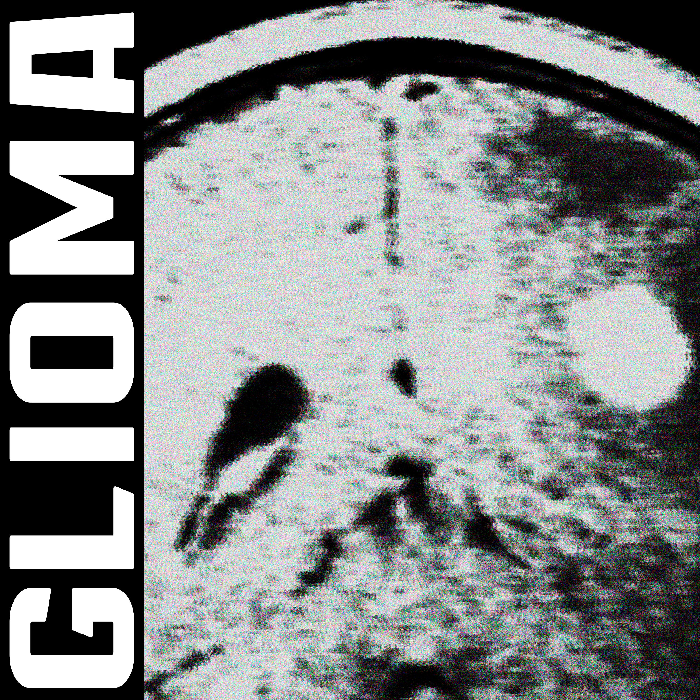

<h1 align=center>

</h1>

<iframe src="https://archive.org/embed/zqwy_glioma" width="500" height="30" frameborder="0" webkitallowfullscreen="true" mozallowfullscreen="true" allowfullscreen></iframe>

>[!abstract] Сюжет Композиции
># В преддверии самозабвенного [[dystopian_future|уничтожение человечества]], наиболее уязвимым объектом для массовой атаки, оказался человеческий мозг. [[deploy/to-east.github.io/content/music/cyber_logos|Кибер логос]] в ходе успешного анализа уязвимостей, сформулировал скрытый способ атаки с помощью ярких и быстро мигающих вспышек. 
># Они довели человеческие взаимоотношений до абсурда и [[not_diverse|отсутствие разнообразности]] 
># Исход человека привязан с бегом Акса в пустыни в поисках лабиринта
># Гибель разума приводит к пустоте и инертном в бесконечном цикле [[voidstorm| бури пустоты]] которая засасывает внутрь своей нескончаемым разнообразие и в следствие - единообразие

>[!info] Описание Композиции

>[!faq] Какие Инструменты Используются?

>[!faq] Где Возможно Послушать?
> 💽 [Archive](https://archive.org/details/zqwy_glioma)    [pond5](https://www.pond5.com/ru/royalty-free-music/item/292062079-glioma-dark-ambient-drone-sci-fi-cyber)   🟢𝄞 [Spotify]()   🟪 SumbitHub: https://www.submithub.com/artist/zqwy   🔊 Soundclick: http://soundclick.com/   🎼 Audiomack: https://audiomack.com/zqwy   🎤 Rapchat: https://rapchat.com/profile/340DB690-9E23-11EB-8017-D314B4DFDD5D   🍏 AppleMusic: https://music.apple.com/ru/artist/zqwy/1524644220   📦 AmazonMusic: https://music.amazon.com/artists/B08FXPSYSW/zqwy  👍 YandexMusic: https://music.yandex.ru/artist/9811686  🥚 MTSMusic: https://music.mts.ru/artist/9811686  🏛️ SberZvuk: https://zvuk.com/artist/211125232  🦌 Deezer: https://www.deezer.com/ru/artist/104037322   🌀 Shazam: https://www.shazam.com/artist/zqwy/1524644220   🎵 [Bandcamp](https://zqwy.bandcamp.com/track/glioma)  🐼 Pandora: https://www.pandora.com/artist/zqwy/ARlndnxfh6fpnqg   🧊 Qobuz: https://www.qobuz.com/us-en/interpreter/zqwy/13364978   👌 OK: https://ok.ru/music/artist/122906744693434   🌊 Tidal: https://tidal.com/browse/artist/20930958?u   ⭕ Audius: https://audius.co/_zqwy_   🌸 Flo: https://www.music-flo.com/detail/artist/406541046  🎶 allmusic    [lastfm](https://www.last.fm/music/Zqwy/Biela)    [youtube](https://youtu.be/ybMHyWendr4)   [rumble](https://rumble.com/v75a70s-mysterious-soundtrack-esoteric-atmosphere-orchestra-folk-phonk-occultism-ma.html)   [rutube](https://rutube.ru/video/private/b584036244839371593c7eac5a6d5f04/?p=QL2isHruMBa-eo9OL3jANw)    ➖ [substack](https://substack.com/@zqwy)   📷 [instagram](https://www.instagram.com/z_q_w_y/)   [x](https://x.com/Z_Q_W_Y)    💆 [Dzen](https://dzen.ru/zqwy)   🐘 [Mastodon](https://mastodon.social/@zqwy)  📘 [Facebook]([https://www.facebook.com/](https://www.facebook.com/profile.php?id=61587212234227))   [odysee](https://odysee.com)   https://www.tumblr.com   https://discord.com/   https://bsky.app/profile/z-q-w-y.bsky.social   https://www.newgrounds.com   https://www.livejournal.com   https://fotostrana.ru  

