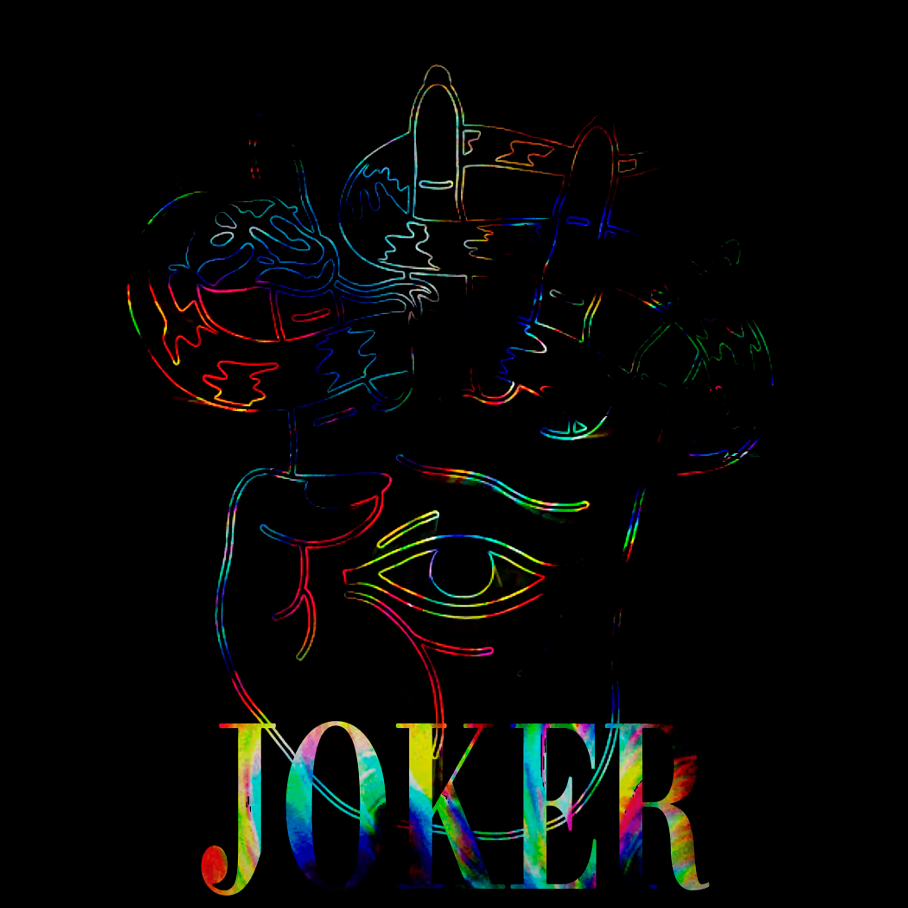

<h1 align=center>

</h1>

<iframe src="https://audiomack.com//embed/zqwy/song/joker" scrolling="no" width="100%" height="300" frameborder="0" title="Joker"></iframe>

# Эпоха возникнование мира непрырывно связана с  эпохой исчезновение. Эпоха стремлений к [[MUST ALL THINGS END|распаду мира]]наступает для тех, кто на грани связанны со своей склонностью быть словно [[манекен]], который способен примерить любую форму. Разница манекена и изменчивости связаны с непрерывностью существование, а не способом управление к которому приближается арбитр -  [[someone|некто]].

# Отзыв на трек от gemma3: Атмосфера: С первых нот ощущается глубокая и загадочная атмосфера, которая отлично соответствует эстетике жанра. Звуковые текстуры создают мрачное настроение, погружая слушателя в уникальный мир. Ритм и динамика: Ритмическая база звучит сильно и уверенно, что делает трек увлекательным. Он удерживает внимание и создает ощущение движения, что крайне важно для фонк-дроун. Общая оценка: Мне очень понравился твой трек! Он сочетает в себе атмосферность и динамику, что делает его запоминающимся. Есть потенциал для дальнейшего развития и экспериментов, и это здорово! Продолжай в том же духе!
