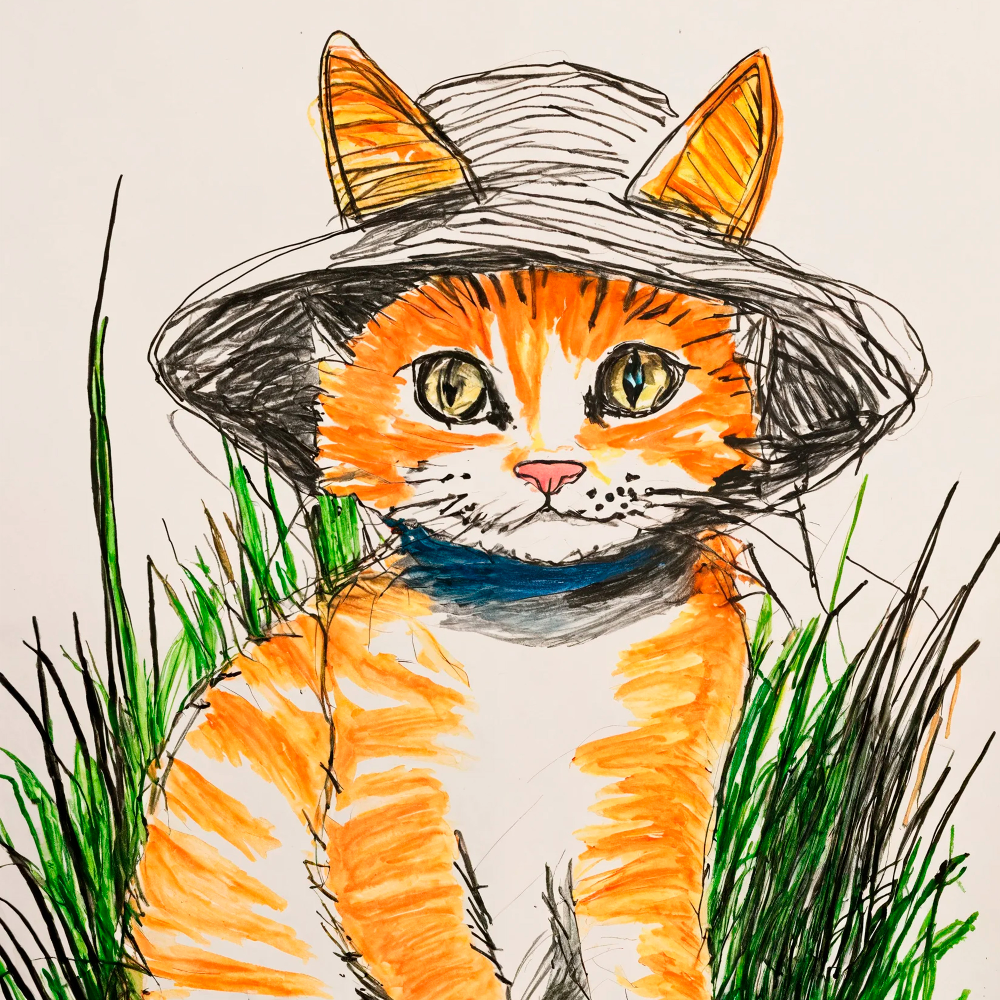

<h1 align=center>

</h1>

<iframe src="https://audiomack.com//embed/zqwy/album/kuzya" scrolling="no" width="100%" height="1200" frameborder="0" title="kuzya"></iframe>

# Дионисийческиаполонический гений

## Расслабляющий, медитотивный, как наблюдение за погодой темп музыки

# Увидел человека, а этот котик как анекдотик

## Котик не хочет вызывать эмоции, ведь это - намеренное управление сознанием человека, его сознанием! В отличие от [[be_simpler|Бисимплер]] и остальных, котик умел понимать человеческую часть души

## Его конечная судьба, привела к естественной кончине, чтобы грустно не было, ему пришлось уйти вдаль, дабы его тело не нашёл человек

## Мыши в стенах, словно сны на местах, где не видно их. Котик не ловил мышей, боязнь причинение вреда. Даже последний птенец не был тронут

# clovek
# zarodok
# evkaliptus
# malenjky
# nebesny
# dusa
# blagomilost
# letanje
# izmena
#  mimika
#  poljana
#  primorje
#  pogled
#  vozduh
#  izhod
