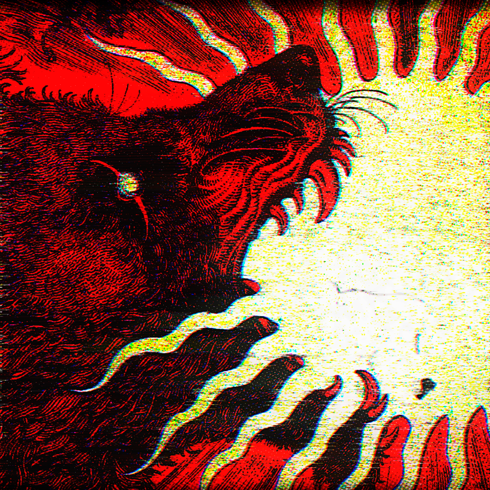

<h1 align=center>

</h1>

<iframe src="https://audiomack.com//embed/zqwy/song/must-all-things-end" scrolling="no" width="100%" height="252" frameborder="0" title="MUST ALL THINGS END"></iframe>

## Эпоха уничтожение мира - катарсис события приближение уничтожения мира свершился, угрозы пред живыми, оказались не пустыми обещаниями, а воплощением идей[[not_diverse| не разнообразности]]
