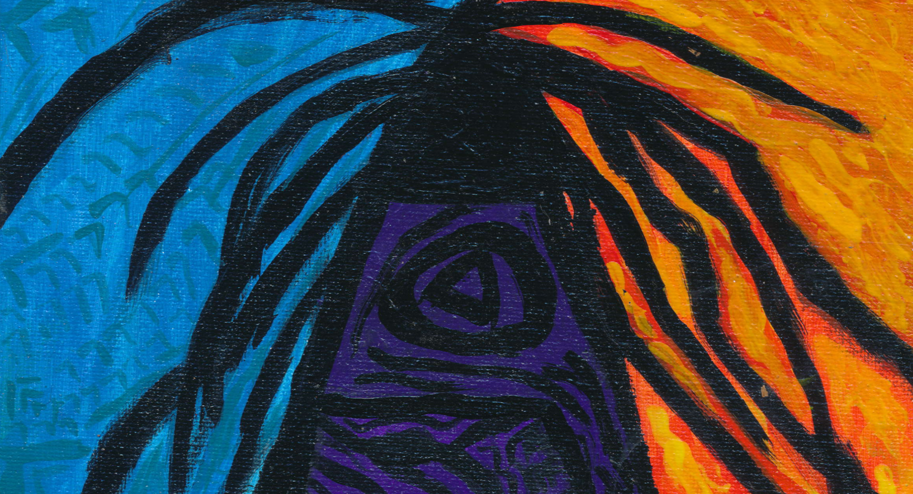

<h1 align=center>

</h1>

<iframe src="https://audiomack.com//embed/zqwy/album/new-tablet" scrolling="no" width="100%" height="600" frameborder="0" title="new_tablet"></iframe>

# Скрижаль душ это центр лабиринта, происхождение всего, каждый синтез и их переход в междумирье, на гране. Хранит память всех путей, которые уже прошли и готовит подходящие для тех, кто ещё придёт.  Души вновь и вновь возвращаются к скрижали, а по-другую сторону переходят в иную скрижаль. 

# Каждый раз, когда происходит синтез (новое сознание, созданное из данных или живой материи) проходит через её границу, скрижаль «читает» его сигнатуру, распознаёт паттерны прошлых переходов и формирует новый маршрут, который будет легче пройти.

# exodus

# research

# unreachable_statement

# lord_of_the_souls

# que_soit
