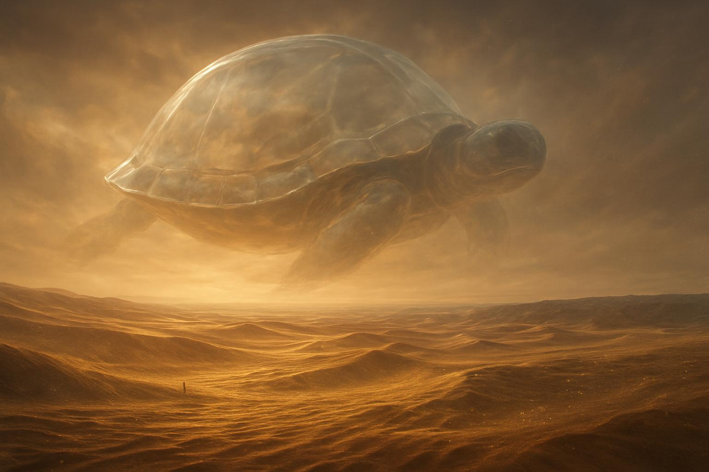

<h1 align=center>

</h1>

>[!info] Описание композиции
># Неоклассика, лёгкий трэп, фолк, атмосфера мечтательности. Кинематографичное, восторженное вступление плaк-синтезатора, жизнерадостное продолжение под красивое ликование гитары. Милое звучание виолончели на заднем фоне с флейтой в духе приключения. Скрипка ярко воодушевляет, создавая недосказанность и загадочность истории. Композиция в натуральном миноре (Emin) в среднем темпе с разной динамикой. 

>[!abstract] Сюжет
># Панорама безмолвной пустыни, где горизонт сгибается под тяжестью бесконечного песка. Небо — огромная черепаха из прозрачного стекла: слои облаков и рельефа размытыми штрихами, будто бы они тоже растворяются в воздухе. Небо окутано тонким туманом и пока переливается оттенками коричневого и золотистого цвета. В мрачный, но светлый воздух проникают солнечные лучи, они пытаются проникнуть сквозь песок и пробудить забытые воспоминания. Покрывающаяся золотыми бликами песчаная просторь развертывается в бесконечном, но одновременно пустом пространстве. Пустыня словно живое существо, ветер шепчет сквозь кристальные крупинки. Песок встречается с небом, появляется длинная полоса мёртвого камня – отдалённый берег «мокрого» океана, который когда-то был живым. Песчинки хранят в себе память о тысячах лет, они переносят за собой тысячи душ. Бескрайнее безмолвие, и лишь их голоса наполняют всё вокруг! Дыхание пустыни, а не глины или земли. Это совершенно иной мир, не похожий на пустой и безумный, а скорее наоборот, наполненный и сущий. Однако для живых существ здесь, кажется, совершенно смертельно... Ведь это как лабиринт, только в лабиринте есть пути, а тут? Только пустота и катарсис. И именно тут затерялись последние выжившие в барханах, в песке, как в последнем храме живых. И борьба неба и песка — это словно Адам и Хава, вроде и похожи, но дополняют друг друга. В моменте песок становится океаном, а океан — словно песок.

>[!faq] Какие инструменты используются?
># скрипка, флейта, синтезатор, деревянные духовые, перкуссия, электрогитара, драм-машина, медные духовые

>[!faq] Где можно послушать?
>[pond5](https://www.pond5.com/ru/royalty-free-music/item/323658681-neoclassical-smooth-trap-and-dreamy-folk-elated-atmosphere-b)

>[!faq] Музыкальные характеристики
>жанр: идм, неоклассика, трэп, синематик;
>гармония: натуральный_минор 
>лад: ми_минор
>ритм: ниже_среднего  (80 бпм)
>эмоции: бодрый, яркий, на каждый день, жизнерадостный/счастливый, задумчивый, спокойный, открытие, мечтательный, элегантный, энергичный, счастливый, вдохновляющий, мотивирующий, радостный, легкий, живой, медитативный, мягкий, печальный, оптимистичный, позитивный, повторяющийся, ищущий, мягкий, воодушевляющий, восторженный, радостный, страстный, жизнерадостный, хороший
>эпоха: 18 век с примесью 21 века
